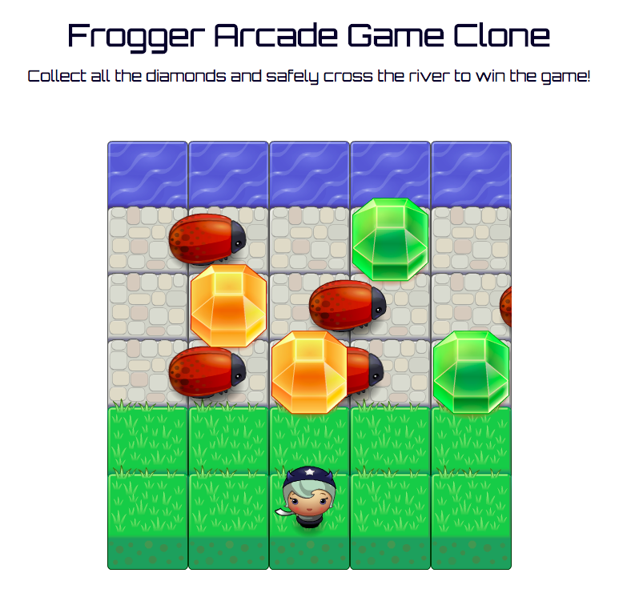
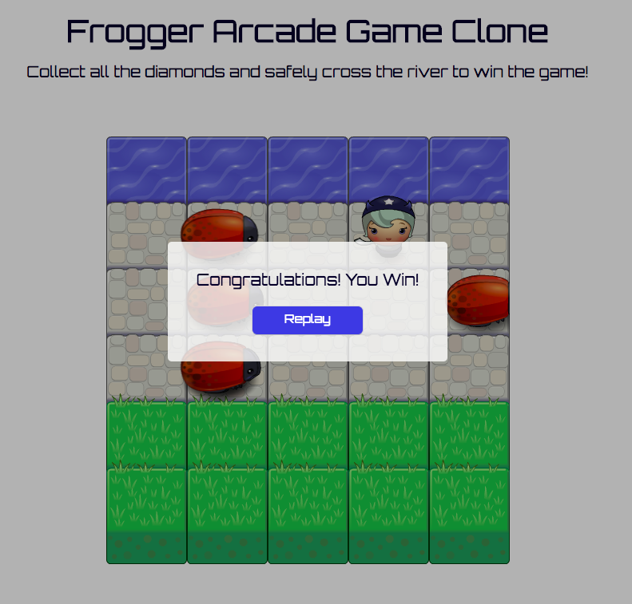

# Classic Arcade Game Clone 

Click here to play https://thesophietran.github.io/Classic-Arcade-Game-Clone/

## Game Description 
In this game you have a Player and Enemies (Bugs). The goal of the player is to reach the water and acquire all the diamonds. The player can move left, right, up and down. The enemies move in varying speeds on the paved block portion of the scene. Once the player collides with an enemy, the player is sent back to the starting position. Once the player reaches the water and obtains all diamonds, the game is won. A popup modal will ask if the player wants to play again. 

## Game Interface 
Starting game 

  

Winning the game

  

Have fun! 😀
